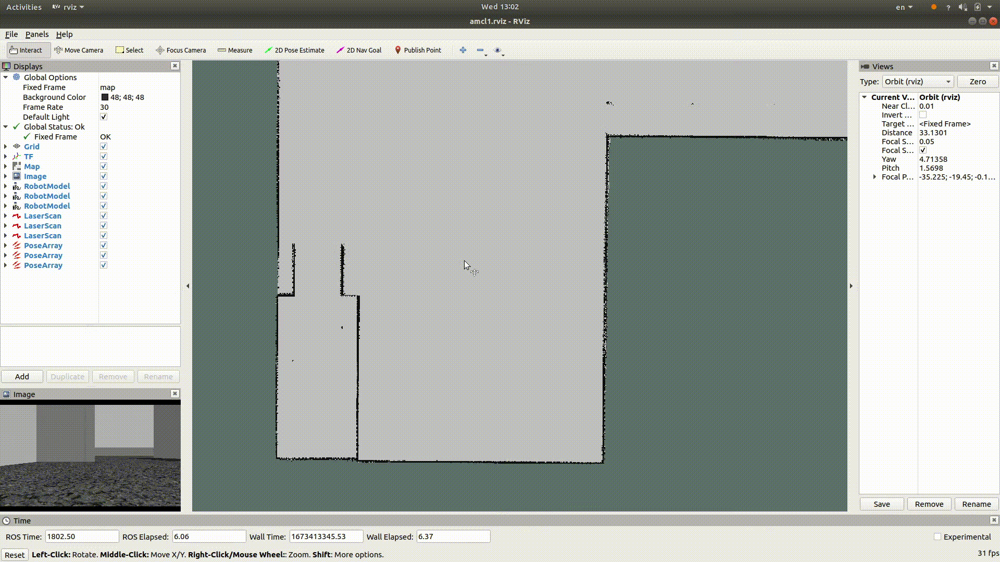

# chassis control
This repository contains a Gazebo simulation model of shooting range world and a differential drive robot. It is meant to be a very flexible simulation platform that supports single and multiple chassis simulations in the shooting range.

## dependences and environment
Ubuntu 18.04 with ROS melodic.
Before you launch the simulation, you should download some basic gazebo models [here](https://github.com/osrf/gazebo_models).
```bash
cd ~/.gazebo/ # if you do not have the dir, create it firstly
git clone https://github.com/osrf/gazebo_models.git models
```

## usage
Create your working directory and download the code
```bash
cd ~/your/working/dir/
git clone https://github.com/molguitianzn/chassis-control.git
cd chassis-control
catkin_make
```
### launch simulation
launch the simulation platform.
```bash
cd ~/your/working/dir/chassis-control
source devel/setup.bash
roslaunch robot_and_world robots_world.launch
```
### SLAM work
Then you can launch gmapping node to construct the map.
```bash
roslaunch robot_localization launch_gmapping.launch
```
Move the robot to finish the mapping task.
```bash
rosrun teleop_twist_keyboard teleop_twist_keyboard.py /cmd_vel:=/robot1/cmd_vel
```
Robot1 is used to create the map as default. However, you can modify the "robot_frame_prefix" argument field in [launch_gmapping.launch](./src/robot_localization/launch/launch_gmapping.launch) with any robot you want.
To save the map, run the following line of code.
```bash
roslaunch robot_localization save_map.launch
```
I have created a map in [robot_localization/map/shooting_range_map1.yaml](./src/robot_localization/map/shooting_range_map1.yaml)

### LiDAR localization
The robots are equiped with a single-ray lidar, thus I choose AMCL to localize the robot.
```bash
roslaunch robot_localization launch_amcl.launch
```
#### set initial pose
To set the initial pose of each robot in rviz, I make a [ros node](./src/robot_localization/src/set_estimate_pose.cpp) called "set_pose_estimate" which subscribes the "/initialpose" topic publishd by rviz, then publish the message to each AMCL nodes for the  robots in order. [launch_amcl.launch](./src/robot_localization/launch/launch_amcl.launch#L13) has included the "set_estimate_pose" node. Thus when you launch [launch_amcl.launch](./src/robot_localization/launch/launch_amcl.launch), you should set the initial robot pose for each robot with "2D Pose Estimate" tool in rviz orderly, like this:

#### Attentions
1. If you construct the map yourself, remember to modify the map file name in "map" field of [launch_amcl.launch](./src/robot_localization/launch/launch_amcl.launch#L2).
2. If you have added new robots, remember to add some code blocks in [launch_amcl.launch](./src/robot_localization/launch/launch_amcl.launch) as follow to localize these new robots.
```bash
<include file="$(find robot_localization)/launch/node_amcl.launch">
        <arg name="robot_frame_prefix" value="robotx"/>
</include>
```
x in value "robotx" is the index of the robot. Then you should also modify the number in "args" field of [this line](./src/robot_localization/launch/launch_amcl.launch#L13).
